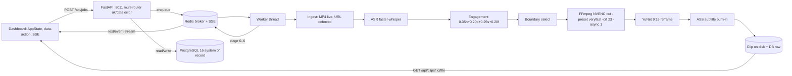

# Clippify SaaS

Clippify turns a long video into one scroll-stopping vertical clip: it transcribes the
audio, scores every moment with a fixed engagement formula, cuts the strongest window,
reframes it to 9:16 centered on the speaker, and burns in captions — delivered through a
self-contained FastAPI + PostgreSQL 16 + Redis stack on port **`:8011`**.

> **This is the walking-skeleton pass.** The full vertical slice (upload to finished clip)
> works end to end. Breadth features (URL ingest, long-video map-reduce, Stripe billing,
> OAuth publishing) are present as **typed interfaces returning a clean `deferred` signal**
> at exactly one seam each — see [Deferred features](#deferred-features).

## Acceptance test (the north star)

On a fresh checkout, one command boots everything and this flow works:

1. Open <http://localhost:8011/dashboard> and **sign in** with the seeded user.
2. **Upload** a short MP4 (<= 10 min).
3. Watch the **SSE progress** advance through stages **0 -> 6** (`Queued ... Complete`).
4. The finished **vertical, captioned clip** appears and is **downloadable**.

**Seeded login:** `demo@clippify.dev` / `clippify-demo`

## Prerequisites

- **Docker** + Docker Compose (the only requirement to run the stack).
- For running outside Docker on the Windows host: **FFmpeg** at `C:\ffmpeg\bin\ffmpeg.exe`
  and `C:\ffmpeg\bin\ffprobe.exe`, **PostgreSQL 16**, and **Python 3.14** (invoked as bare
  `python`). Inside the container these are provided automatically.
- A GPU is **not** required: set `VIDEO_CODEC=x264` (default) to run the NVENC-flagged cut
  pass through libx264 so the demo renders without NVIDIA hardware. Set `VIDEO_CODEC=nvenc`
  on a GPU host.

## Quickstart

```bash
cp .env.example .env          # then edit if you like; defaults work for local demo
docker compose -f docker-compose.saas.yml up --build
# open http://localhost:8011/dashboard
```

The API container runs migrations (`alembic upgrade head`), seeds the dev user, and starts
the in-process worker automatically. Redis and PostgreSQL are **internal only** — no host
ports are published for them.

## Environment variables

| Variable | Purpose | Default |
|---|---|---|
| `APP_SECRET` | Signs the `mf_session` cookie | dev placeholder |
| `APP_PORT` | API port | `8011` |
| `DATABASE_URL` | PostgreSQL 16 DSN (system of record) | `...@db:5432/clippify` |
| `REDIS_URL` | Broker + SSE transport only | `redis://redis:6379/0` |
| `FFMPEG_BIN` / `FFPROBE_BIN` | FFmpeg binaries (Windows abs paths; compose overrides to container paths) | `C:\ffmpeg\bin\...` |
| `VIDEO_CODEC` | `nvenc` (GPU) or `x264` (fallback) | `x264` |
| `ASR_MODEL` / `ASR_DEVICE` | faster-whisper model + device | `tiny` / `cpu` |
| `YUNET_MODEL_URL` | Source for the bundled YuNet ONNX (cached on first use) | opencv_zoo |
| `SEED_USER_EMAIL` / `SEED_USER_PASSWORD` / `SEED_USER_CREDITS` | Dev login seeded on boot | demo user / 30 |
| `STRIPE_SECRET_KEY` / `STRIPE_WEBHOOK_SECRET` | **Deferred** — leave blank (SDK stays lazy-unloaded) | empty |
| `YOUTUBE_OAUTH_CLIENT_ID` / `_SECRET` | **Deferred** publishing | empty |

Never commit a real `.env`. Only `.env.example` (placeholders) is tracked.

## Database migrations

```bash
alembic upgrade head                              # apply (run automatically on boot)
alembic revision --autogenerate -m "describe"     # create a new migration
alembic downgrade -1                              # roll back one
```

## Architecture



The engagement score is the frozen formula
`0.35*hook + 0.20*pace + 0.25*sentiment + 0.20*face` (`saas/scoring.py`), and the SSE
`STEP_LABELS` (`saas/sse.py`) are the frozen stages 0 -> 6 the dashboard renders.

## Deferred features

Each is a named interface that the live spine calls; it returns a clean `deferred` signal
at one seam. The next pass implements behind the interface without touching the spine.

| Feature | Interface | Plugs in at |
|---|---|---|
| YouTube / Twitch URL ingest | `YouTubeSource` / `TwitchSource` (`saas/pipeline/base.py`) | `saas/pipeline/ingest_url.py` (new) |
| Long-video map-reduce (1-3 h, block-parallel ASR, checkpoint/resume) | `MapReduceStrategy` (`saas/pipeline/base.py`) | `saas/pipeline/mapreduce.py` (new) |
| Stripe billing (checkout, portal, HMAC-SHA256 webhook) | `create_checkout_session()` / `handle_webhook()` (`saas/billing_core.py`) | same file; `POST /api/billing/checkout` |
| OAuth publishing (OAuth 2.0 only, forced `private`/`SELF_ONLY`) | `POST /api/publish/{clip_id}` (`saas/routers/publish.py`) | `saas/publish_core.py` (new) |
| Magic-link / set-password onboarding | seeded user only for now | `saas/auth_onboarding.py` (new) |

The frozen contract surfaces — `AppState` keys, the single delegated `data-action` switch,
the `{ok, data | error}` envelope, and `STEP_LABELS` — are present and match the final spec,
so deferred passes plug straight in.

## License

GPL-3.0-only. The render path bundles FFmpeg-derived (GPL) components; that obligation
propagates to the whole work. See [`LICENSE`](./LICENSE).
