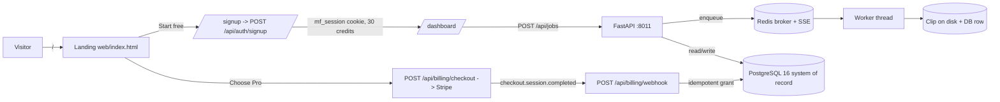

# Clippify

Clippify turns a long video into scroll-stopping vertical clips: it transcribes the
audio, scores every moment with a fixed engagement formula, cuts the strongest window,
reframes it to 9:16 centered on the speaker, and burns in captions — delivered through a
self-contained **FastAPI + PostgreSQL 16 + Redis** stack on port **`:8011`**.

This repository is the **unified product**: the marketing landing page and the SaaS app
are one single-origin application. A visitor lands on `/`, clicks **Start free**, creates
an account (30 free credits), uploads an MP4, watches the pipeline stream **0→6**,
downloads the finished clip, and can buy a paid plan through **Stripe Checkout** with
credits granted automatically by webhook.

## Architecture (single origin)

```
/            → marketing landing  (pre-rendered static page, web/index.html)
/signup      → account creation   (web/signup.html → POST /api/auth/signup)
/dashboard   → the app            (web/dashboard.html + web/app.js, SSE 0→6)
/api/*       → FastAPI surface     ({ok, data | error} envelope)
/config.js   → public runtime config (Sentry DSN / Plausible domain, env-driven)
/robots.txt /sitemap.xml /favicon.ico → SEO assets
```

- **One origin**, so there are no CORS/cookie headaches. FastAPI serves the frontend
  from `web/` (mounted at `/static`) plus the page routes above.
- **Design system is one source of truth.** `web/tokens.css` is the canonical palette
  (charcoal `#0A0A0A`, neon orange `#FF7A00`, glass, Archivo + Inter). The dashboard and
  static landing link it directly; the React site's `tailwind.config.js` consumes its
  `--rgb-*` variables via `rgb(var(--x) / <alpha-value>)`, so opacity modifiers keep
  working and both halves stay visually identical.
- **Marketing source vs. served artifact.** The editable marketing site is the
  Vite + React + Tailwind project in [`site/`](./site). The page actually served at `/`
  is the pre-rendered, crawler-friendly static `web/index.html` (same copy, same tokens,
  real content with no JS required). Edit the design in `site/` (`npm run dev`); the
  static page is the deployable, SEO-complete render of it.



## Acceptance test (the north star)

On a fresh checkout, one command boots everything and this full journey works:

1. Open <http://localhost:8011/> → click **Start free** → create a brand-new account →
   land on the dashboard with **30 credits**.
2. **Upload** a short MP4 (≤ 10 min). Watch the **SSE progress** advance **0→6**
   (`Queued … Complete`). The finished **vertical, captioned clip** appears and
   **downloads**.
3. Click a paid tier → complete **Stripe test Checkout** (card `4242 4242 4242 4242`) →
   credits are granted automatically by the webhook → the **billing portal** opens from
   the dashboard's *Billing* button.

**Seeded login (skips signup):** `demo@clippify.dev` / `clippify-demo`

## Quickstart

```bash
cp .env.example .env          # defaults work for a local demo
docker compose -f docker-compose.saas.yml up --build
# open http://localhost:8011/
```

The API container runs migrations (`alembic upgrade head`), seeds the dev user, and
starts the in-process worker automatically. Redis and PostgreSQL are **internal only** —
no host ports are published for them.

### Running the marketing site in dev (optional)

```bash
cd site
npm install            # npm 11: if esbuild is skipped, run `npm approve-scripts esbuild`
npm run dev            # Vite dev server with hot reload
npm run build          # type-check + production build (verifies the source compiles)
```

## Billing (Stripe)

Billing is **off by default** and degrades gracefully: with `STRIPE_SECRET_KEY` unset
the app boots normally, the pricing UI renders, and checkout/portal return a clean
`deferred`. Set the two Stripe vars to go live. The SDK is lazy-loaded only when the
secret key is present; webhooks are verified by our own HMAC-SHA256 over the **raw body**
and grants are **idempotent** (keyed on the Stripe event id in `stripe_events`).

The frozen tier catalog: Free `$0` / 30 (one-time), Starter `$14.99` / 200, Pro `$29.99`
/ 500 (**Most popular**), Scale `$59.99` / 1,200 — billed annually.

Full local test loop — Stripe CLI listener + trigger and the test card — is in
**[STRIPE_LOCAL_TESTING.md](./STRIPE_LOCAL_TESTING.md)**.

## Environment variables

| Variable | Purpose | Default |
|---|---|---|
| `APP_SECRET` | Signs the `mf_session` cookie | dev value (change in prod) |
| `APP_ENV` | `production` tags Sentry + disables the webhook demo-user fallback | `development` |
| `APP_BASE_URL` | Public origin (Stripe return URLs) | `http://localhost:8011` |
| `DATABASE_URL` | PostgreSQL 16 DSN (system of record) | `…@db:5432/clippify` |
| `REDIS_URL` | Broker + SSE transport only | `redis://redis:6379/0` |
| `FFMPEG_BIN` / `FFPROBE_BIN` | FFmpeg binaries (Windows abs paths; compose overrides to container paths) | `C:\ffmpeg\bin\…` |
| `VIDEO_CODEC` | `nvenc` (GPU) or `x264` (fallback) | `x264` |
| `ASR_MODEL` / `ASR_DEVICE` | faster-whisper model + device | `tiny` / `cpu` |
| `STRIPE_SECRET_KEY` / `STRIPE_WEBHOOK_SECRET` | Enable billing (lazy SDK; HMAC verify). Blank = billing off | empty |
| `STRIPE_PRICE_STARTER/PRO/SCALE` | Optional real Price IDs; blank = inline price from the frozen catalog | empty |
| `SENTRY_DSN` / `SENTRY_TRACES_SAMPLE_RATE` | Error + performance monitoring. Blank DSN = disabled | empty / `0.1` |
| `PLAUSIBLE_DOMAIN` | Privacy-friendly analytics domain. Blank = no script (respects DNT) | empty |
| `CLIPPIFY_IMAGE` | Deploy: image compose pulls on the host | `clippify-saas-api:latest` |

Never commit a real `.env`. Only `.env.example` (example values) is tracked; it is the
authoritative list of every variable.

## Database migrations

```bash
alembic upgrade head                              # apply (runs automatically on boot)
alembic revision --autogenerate -m "describe"     # new migration
alembic downgrade -1                              # roll back one
```

`0002_billing` is additive (user `tier` + `stripe_customer_id`, `stripe_events` table) and
applies cleanly on both a fresh DB and the seeded one.

## CI / CD, monitoring, security

- **CI** (`.github/workflows/ci.yml`): ruff lint, the FastAPI-pin assertion (`== 0.115`),
  the sub-router-survival check (now also guarding `/api/auth/signup` and the billing
  sub-routes), and a compose build + `/health` smoke test.
- **CD** (`.github/workflows/deploy.yml`): on `main`, builds the image, pushes it to GHCR,
  and deploys over SSH to the container host (`docker compose pull && up -d`), gated on a
  post-deploy `/health` check. Requires `DEPLOY_HOST`, `DEPLOY_USER`, `DEPLOY_SSH_KEY`,
  `DEPLOY_PATH` secrets and a `production` environment.
- **Security**: CodeQL (`codeql.yml`, Python + JS/TS) and Dependabot
  (`dependabot.yml`, pip/npm/actions/docker; the FastAPI pin is protected from minor/major
  bumps).
- **Monitoring**: Sentry on the backend (`SENTRY_DSN`) and the front end
  (`web/runtime.js` via `/config.js`). **Health/readiness**: `/health` (liveness) and
  `/ready` (Postgres reachable) — the Docker/compose healthcheck uses `/health`.
- **Analytics**: Plausible, loaded only when `PLAUSIBLE_DOMAIN` is set, cookie-free, no
  PII, and skipped under Do-Not-Track.

## Production / HTTPS

Run the container behind a reverse proxy (Caddy, nginx, or a managed load balancer) that
terminates TLS and forwards to `:8011`. Set `APP_ENV=production`, a strong `APP_SECRET`,
real DB credentials, and `APP_BASE_URL=https://yourdomain`. PostgreSQL and Redis stay on
the internal network — never publish their ports. Point the host's compose at the pushed
image with `CLIPPIFY_IMAGE=ghcr.io/<owner>/<repo>:latest`.

## Deferred seams (out of scope, clean interfaces)

| Feature | Interface | Plugs in at |
|---|---|---|
| YouTube / Twitch URL ingest | `YouTubeSource` / `TwitchSource` (`saas/pipeline/base.py`) | `saas/pipeline/ingest_url.py` |
| Long-video map-reduce | `MapReduceStrategy` (`saas/pipeline/base.py`) | `saas/pipeline/mapreduce.py` |
| OAuth publishing (OAuth 2.0 only, forced `private`/`SELF_ONLY`) | `POST /api/publish/{clip_id}` | `saas/publish_core.py` |

Signup and Stripe billing — previously deferred — are **implemented** in this repo.

## License

GPL-3.0-only. The render path bundles FFmpeg-derived (GPL) components; that obligation
propagates to the whole work. See [`LICENSE`](./LICENSE).
